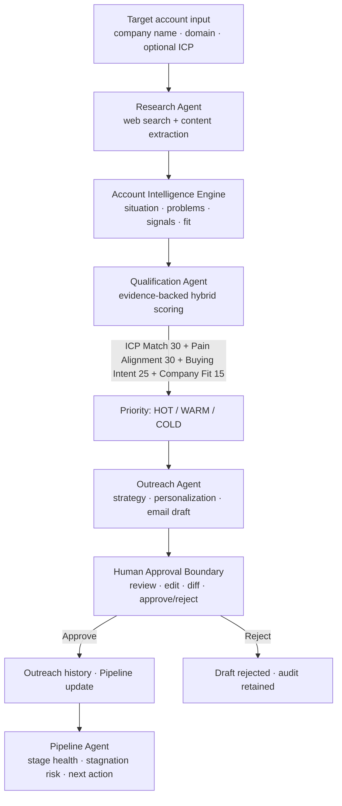
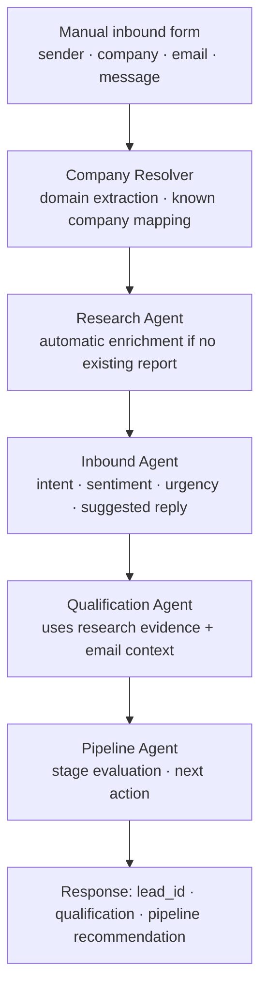

# ScoutOS — AI-Powered BDR Operating System

> **Role:** outbound-bdr  
> **Hackathon:** FlytBase Outbound BDR Hackathon 2026  
> **Stack:** Python 3.14, FastAPI, PostgreSQL, SQLAlchemy, Jinja2, Alpine.js, Tailwind CSS  
> **Deployment:** Railway (`https://flytbasehackthon-production.up.railway.app`)

---

## What I built

**ScoutOS** is an AI-native outbound BDR operating system. It transforms a target account (company/domain) into researched intelligence, evidence-backed qualification, a personalized outreach draft, and pipeline follow-up — with a hard **human approval** boundary before any outbound communication.

Five specialized AI agents work together in a coordinated pipeline. This is not a chatbot — it's a multi-agent system where each agent has distinct responsibilities, tools, and output structures.

### Problem

Outbound BDRs lose time and quality when:

- Account research is manual and inconsistent
- Outreach is generic because structured intelligence never reaches the draft
- Qualification is gut-feel instead of evidence-based scoring
- Pipeline context is scattered across spreadsheets, emails, and notes
- No audit trail exists for why a lead was prioritized or contacted
- Context is lost between phases — research doesn't feed qualification, which doesn't feed outreach

### Solution (outbound-first)

ScoutOS runs a multi-agent outbound workflow:

1. Accept **target account input** (company name/domain, optional ICP config)
2. **Research** the account via web search + content extraction + LLM synthesis
3. Build **Account Intelligence** (company situation, problems, risks, signals, FlytBase fit)
4. **Qualify** with evidence-backed hybrid scoring → HOT / WARM / COLD
5. **Generate outreach** (strategy → personalization → draft) — **never auto-sent**
6. Require **human approval** (review, optional inline edit with diff, approve/reject)
7. Track the opportunity in **Pipeline** with stage health and next-action recommendations

**Secondary capability:** Manual **inbound email simulation** (`/api/v1/inbound/simulate`) lets a BDR process a reply or inquiry through Inbound → Qualification → Pipeline without connecting a mailbox.

### Key product properties (implemented)

| Property | Implementation |
|----------|----------------|
| Multi-agent, not a chatbot | Five specialized agents with structured outputs and distinct responsibilities |
| Provider-neutral AI | `AIProvider` protocol; Anthropic / OpenAI / FreeModel / local via `.env` config |
| Evidence-backed qualification | Scoring model: ICP Match (30) + Pain Alignment (30) + Buying Intent (25) + Company Fit (15), with evidence citations |
| Human-in-the-loop | Outreach drafts always `requires_human_approval`; approve/reject APIs + UI with inline editor and diff view |
| Audit trail | `AgentTask` lifecycle + `AgentLog` step events for every agent execution |
| Account Intelligence Engine | Web search (Tavily + simulated fallback) → content extraction → DeepSeek LLM synthesis into structured intelligence |
| Mission Control UI | 8 Jinja2 views: Dashboard, Leads, Lead Detail, Outreach, Pipeline Kanban, Inbound, Activity, Demo |
| Demo-ready | One-command demo with 5 seeded companies + manual inbound simulation for judge walkthrough |

---

## Architecture / Flow

### Primary outbound flow



### Secondary inbound simulation flow



### Data flow between stages

```text
Target account input (company/domain, optional ICP config)
        │
        ▼
ResearchAgent
        │  ResearchReport
        │  + findings (company_situation, operational_pain_points,
        │    buying_signals, business_signals, why_now, flytbase_fit)
        │  + evidence[] (claim + source_url)
        │  + citations, intelligence_metadata
        │
        ▼
Account Intelligence Engine
        │  Structured: company_situation, pain_points with evidence URLs,
        │  buying_signals, business_signals (categorized), why_now,
        │  flytbase_fit, confidence_score
        │
        ▼
QualificationAgent
        │  QualificationResult
        │  overall_score (0-100) = ICP(30) + Pain(30) + Intent(25) + Fit(15)
        │  evidence_based_reasons[] (each citing specific evidence)
        │  qualification_summary, confidence_score
        │  priority: HOT ≥ 70 | WARM ≥ 40 | COLD < 40
        │
        ▼
OutreachAgent
        │  OutreachDraft (status: pending_approval)
        │  + CompanyIntelligenceBrief (situation, problems, risks, fit)
        │  + email draft (subject, body, follow-up)
        │
        ▼
Human approval (Mission Control UI)
        │  Review: intelligence brief + email draft
        │  Edit: inline editor with word-level diff visualization
        │  Action: approve → OutreachHistory (immutable) | reject + reason
        │
        ▼
PipelineAgent
        │  Aggregates: research, qualification, outreach, inbound, tasks
        │  → stage_health: healthy / stale / critical
        │  → stagnation_risk: low / medium / high
        │  → recommended_next_action
```

### Key architectural decisions

| Decision | Rationale |
|----------|-----------|
| **Provider-neutral AI** | All agents use `AIProvider` protocol via constructor injection — never import concrete providers. Swap Anthropic ↔ OpenAI ↔ FreeModel with a single `.env` variable. |
| **Evidence-backed scoring** | Qualification requires evidence citations for every scored dimension. If no evidence exists, scores default to 0 with an explanation. Prevents hallucinated lead prioritization. |
| **Deterministic + AI hybrid** | ICP Match and overall score/priority are computed deterministically. Pain Alignment, Buying Intent, and Company Fit are AI-evaluated from research evidence. This prevents LLM inconsistency on the fundamentals while leveraging AI for nuanced judgment. |
| **Human approval boundary** | Outreach drafts always start as `pending_approval`. No auto-send. BDR reviews intelligence brief, can edit inline with diff, then explicitly approves or rejects. Creates immutable history records. |
| **Simulated tools for demo** | Web search falls back to realistic simulated data when Tavily API key is absent. Includes Rio Tinto, mining, and drone industry mock data for demo scenarios. |
| **Task lifecycle + audit logs** | Every agent execution goes through `TaskManager` (create → running → completed/failed). Each step is logged with structured `AgentLog` entries for full traceability. |

---

## Agents & responsibilities

| Agent | Role | Primary outputs | Step events logged |
|-------|------|-----------------|-------------------|
| **Research Agent** | Web search + content extraction + evidence-backed LLM synthesis | `ResearchReport` with findings, evidence[] (claim+source_url), intelligence_metadata | research_started, planning_completed, search_started/completed, extraction_started, synthesis_started, report_created, task_completed |
| **Account Intelligence Engine** | Deep situation analysis for BDRs (within Research Agent) | company_situation, operational_pain_points with evidence, buying_signals, business_signals (categorized), why_now, flytbase_fit, confidence_score | N/A (integrated into Research Agent) |
| **Qualification Agent** | Evidence-backed hybrid scoring vs ICP | `QualificationResult`, component scores (ICP/Pain/Intent/Fit), priority, evidence_based_reasons, qualification_summary | qualification_started, icp_config_loaded, deterministic_scoring_started/completed, ai_scoring_started/completed, composite_scoring_started, priority_assigned, qualification_completed |
| **Outreach Agent** | Strategy + personalization + email draft generation | `OutreachDraft` (pending_approval), `CompanyIntelligenceBrief` | outreach_started, qualification_loaded, research_loaded, strategy_generated, hook_generated, draft_completed, intelligence_brief_created, task_completed |
| **Inbound Agent** | Classify inbound signals and generate reply | `InboundMessage`, analysis (intent, sentiment, urgency), suggested reply | inbound_started, analysis_started/completed, reply_generated, task_completed |
| **Pipeline Agent** | Stage health & next best action | Pipeline evaluation, stage_health, stagnation_risk, recommended_action | pipeline_started, data_collected, evaluation_completed, task_completed |

**Shared runtime pattern:** Every agent receives `AIProvider` + `ToolManager` + `TaskManager` via constructor injection (never imports a concrete LLM vendor).

---

## Evidence-backed qualification model

The Qualification Agent uses a hybrid scoring model where every reason references evidence:

| Component | Max pts | Method | What it evaluates | Evidence requirement |
|-----------|---------|--------|-------------------|---------------------|
| **ICP Match** | 30 | Deterministic | Industry alignment (12), company size (9), location (9) | Company profile fields (industry, employee count, location) |
| **Pain Alignment** | 30 | AI (DeepSeek) | Does research show FlytBase-solvable problems? Drone ops, remote monitoring, automation, fleet management, safety/inspection | Operational pain points from research with evidence text and supporting source URLs |
| **Buying Intent** | 25 | AI (DeepSeek) | Recent initiatives, hiring, partnerships, expansion, tech investment, budget signals | Categorized business signals and buying signals with source URLs |
| **Company Fit** | 15 | AI (DeepSeek) | Overall strategic fit, industry relevance, operational scale | Company situation summary, FlytBase fit analysis, evidence claims with sources |

**Priority thresholds:** HOT ≥ 70 | WARM ≥ 40 | COLD < 40

**If no evidence exists:** All AI scores default to 0 with explanation. Overall = ICP only (max 30 → COLD).

---

## System inventory (repo evidence)

### API surface (15+ endpoints)

| Category | Endpoints |
|----------|-----------|
| **Research** | `POST /api/v1/research`, `GET /api/v1/research/{task_id}`, `GET /api/v1/reports/{report_id}` |
| **Qualification** | `POST /api/v1/qualify`, `GET /api/v1/qualification/{task_id}` |
| **Outreach** | `POST /api/v1/outreach`, `GET /api/v1/outreach/{task_id}`, `POST /api/v1/outreach/{draft_id}/approve`, `POST .../reject`, `GET .../history` |
| **Inbound** | `POST /api/v1/inbound`, `POST /api/v1/inbound/simulate`, `GET /api/v1/inbound/{task_id}`, `POST .../{message_id}/approve|reject`, `GET /api/v1/inbound/{task_id}/simulation` |
| **Pipeline** | `POST /api/v1/pipeline/evaluate`, `GET /api/v1/pipeline/leads`, `GET /api/v1/pipeline/{task_id}`, `POST /api/v1/pipeline/{lead_id}/advance` |
| **Activity** | `GET /api/v1/activity`, `GET /api/v1/activity/tasks/{task_id}/logs` |
| **Leads** | `GET /api/v1/leads/{lead_id}/detail` |

### Domain models (PostgreSQL / SQLAlchemy — 15 tables)

**Core:** Companies, Contacts, Leads  
**Agent outputs:** ResearchReports, QualificationResults, OutreachDrafts, InboundMessages  
**Pipeline:** PipelineStages, PipelineStatus  
**Supporting:** AgentTasks, AgentLogs, Conversations, IcpConfigs, CompanyIntelligenceBriefs, OutreachHistory  

### Frontend routes (8 Jinja2 views)

`/demo` (landing), `/dashboard`, `/leads`, `/leads/{id}`, `/outreach`, `/pipeline`, `/inbound`, `/inbound/new`, `/inbound/analysis/{task_id}`, `/activity`

### Tools & providers

- **Tools:** Web search (Tavily API + simulated fallback with Rio Tinto/mining mock data), content extractor (HTTP + simulated fallback)  
- **Providers:** Anthropic-compatible, OpenAI-compatible (NVIDIA DeepSeek V4), FreeModel, local stub  
- **Deployment:** Dockerfile, docker-compose.yml, railway.json, start.sh, .env.example

---

## Demo / Results

The system has been verified end-to-end with Rio Tinto as a demo mining account. The Rio Tinto scenario demonstrates the complete agent pipeline:

1. **Inbound email** from `sarah.williams@riotinto.com` creates a lead via `POST /api/v1/inbound/simulate`
2. **CompanyResolver** maps `riotinto.com` → Rio Tinto, Mining, 50k employees, London/Melbourne
3. **Research Agent** executes 8 category-targeted web searches → extracts content → DeepSeek synthesizes evidence-backed intelligence
4. **Qualification Agent** scores: ICP Match, Pain Alignment, Buying Intent, Company Fit → WARM priority with recommended sales angle
5. **Pipeline Agent** evaluates stage health → recommends follow-up action

### How to produce demo artifacts

```bash
# One-command demo launcher
python scripts/demo.py

# Manual start
uvicorn app.main:app --host 0.0.0.0 --port 8000
# Then open http://localhost:8000/demo
```

Or run against the deployed Railway instance:

```bash
# Inbound simulation
curl -X POST https://flytbasehackthon-production.up.railway.app/api/v1/inbound/simulate \
  -H 'Content-Type: application/json' \
  -d '{"sender_name":"Sarah Williams","company_name":"Rio Tinto","sender_email":"sarah.williams@riotinto.com","message_content":"We are evaluating drone automation for mining operations..."}'
```

### Seeded demo accounts

The seed script populates 5 complete companies with full lifecycle data for Mission Control views:

| Company | Industry | Stage | Score | Priority |
|---------|----------|-------|-------|----------|
| SkyGrid Inc. | Drone Services | Meeting Scheduled | 91 | HOT |
| AeroVista | Drone Technology | Contacted | 78 | HOT |
| DroneFleet Logistics | Logistics | Qualification | 85 | HOT |
| AirMap Technologies | SaaS | Outreach | 62 | WARM |
| PrecisionAg Drones | Agriculture | New | 45 | WARM |

---

## Demo walkthrough (judge path)

| Step | Where | What to show | Talking point |
|------|-------|-------------|---------------|
| 1 | `/demo` | Landing page with agent pipeline visualization | "ScoutOS is a multi-agent BDR system — five specialized agents, not a chatbot." |
| 2 | `/dashboard` | Stats bar (5 leads, 3 HOT), pipeline snapshot, activity feed | "Dashboard gives the BDR a single-pane view of pipeline health." |
| 3 | Lead Detail | Company Profile + Company Intelligence (situation, pain points, buying signals, evidence links) | "The Company Intelligence section shows evidence-backed research with source URLs." |
| 4 | Lead Detail (Qual card) | Qualification score gauge with component breakdown | "Evidence-backed hybrid scoring: ICP Match (30) + Pain Alignment (30) + Buying Intent (25) + Company Fit (15). Every reason references evidence." |
| 5 | `/outreach` | Draft queue with approve/reject | "Every draft requires human approval — never auto-sent. BDR can edit inline with diff visualization." |
| 6 | `/pipeline` | Kanban board with stage health indicators | "Pipeline agent evaluates stage health, stagnation risk, and next action for each lead." |
| 7 | `/activity` | Audit timeline with step-level logs | "Complete audit trail — 26 log events for research, 9 for qualification, 6 for pipeline." |

---

## Testing & quality

| Check | Result |
|-------|--------|
| **pytest** | **235 passed**, 18 skipped, 0 failed |
| **ruff** | Clean (0 errors) |
| **Deployment** | Railway: health check passes, demo accessible |
| **Rio Tinto simulation** | Inbound → Research → Qualification → Pipeline — all agents complete successfully |

---

## Project structure

```
app/
  main.py                 — FastAPI app, frontend routes
  config.py               — Settings from .env
  core/
    contracts.py          — AIProvider, BaseAgent, AIMessage, ToolResult, etc.
    agent_runtime.py      — Agent dispatch
    task_manager.py       — DB-backed task lifecycle + audit logs
    tool_manager.py       — Tool registry
  providers/
    base.py, anthropic.py, openai.py, freemodel.py, local.py, manager.py
  agents/
    research.py           — ResearchAgent (evidence-backed web research + LLM synthesis)
    qualification.py      — QualificationAgent (hybrid scoring: ICP/Pain/Intent/Fit)
    outreach.py           — OutreachAgent (strategy → personalization → draft)
    inbound.py            — InboundAgent (intent/sentiment/urgency classification)
    pipeline.py           — PipelineAgent (stage health, stagnation risk, next action)
    registry.py           — Agent registry wiring
  intelligence/
    company_resolver.py   — Email domain → company profile mapping
    account_research.py   — AccountResearchIntelligence
    outreach_brief.py     — CompanyIntelligenceBriefBuilder
  tools/
    base.py, tool_manager.py
    web_search.py         — WebSearchTool (Tavily + simulated fallback with Rio Tinto data)
    web_extractor.py      — WebContentExtractorTool (HTTP + simulated fallback)
    simulated_web_search.py, simulated_content_extractor.py
  db/
    base.py, session.py, models.py (15 tables)
  api/
    router.py             — All REST endpoints (15+)
  templates/              — 8 Jinja2 views (Mission Control)
  static/                 — CSS, JS (Tailwind + Alpine.js)
tests/                    — 235 unit/integration tests
scripts/
  seed_demo_data.py       — Demo data seeder (5 companies)
  demo.py                 — One-command demo launcher
alembic/                  — 4 database migrations
docs/                     — 10+ documentation files
```

---

## Future roadmap (not claimed as shipped)

- Email send integration for **approved** drafts only  
- Multi-user auth / role-based access  
- CRM sync (Salesforce / HubSpot)  
- Additional search backends (Google CSE, Bing)  
- Analytics dashboard (conversion rates, pipeline velocity)  

---

## Quick start

```bash
# Prerequisites: Python 3.12+, PostgreSQL, virtual environment
source .venv/bin/activate
pip install -e '.[dev]'
alembic upgrade head
python scripts/demo.py
# → http://localhost:8000/demo

# Test
pytest tests/ --tb=short -q  # 235 passed
ruff check . --no-cache       # 0 errors
```

---

## Summary

ScoutOS is an **outbound BDR operating system**: target account in, multi-agent research and evidence-backed qualification out, human-approved personalized outreach, and pipeline intelligence for follow-up. Inbound simulation is a supporting path. Humans stay in control of every outbound message; agents prepare the work with structured, auditable, evidence-backed outputs.
